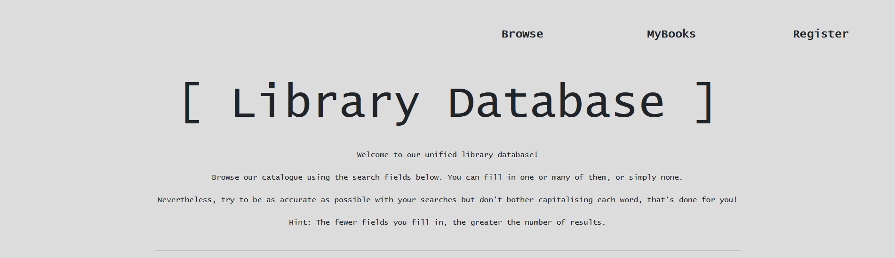
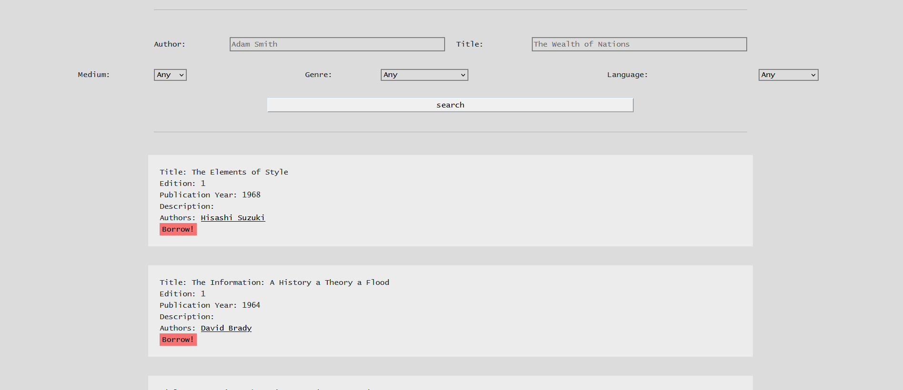
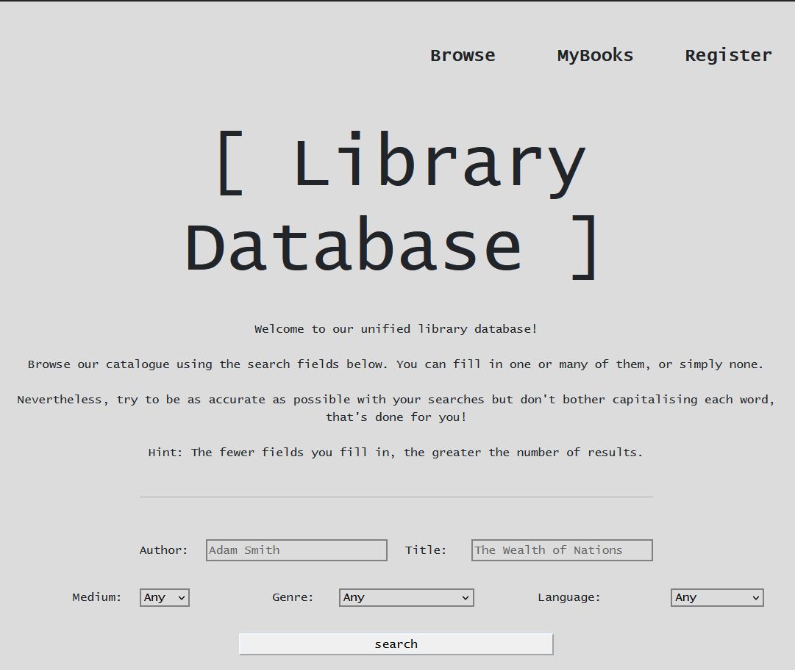
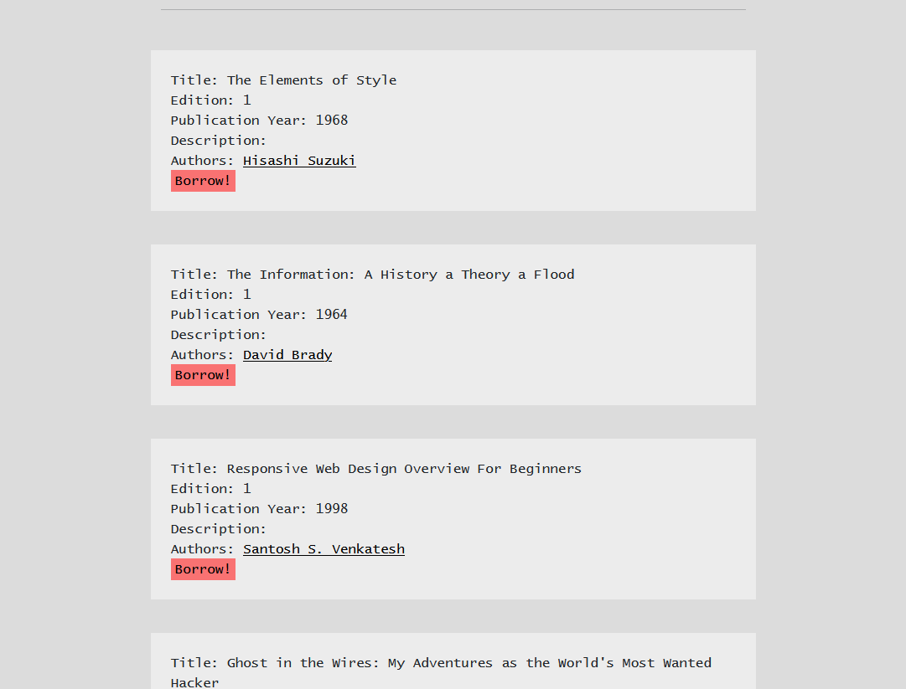
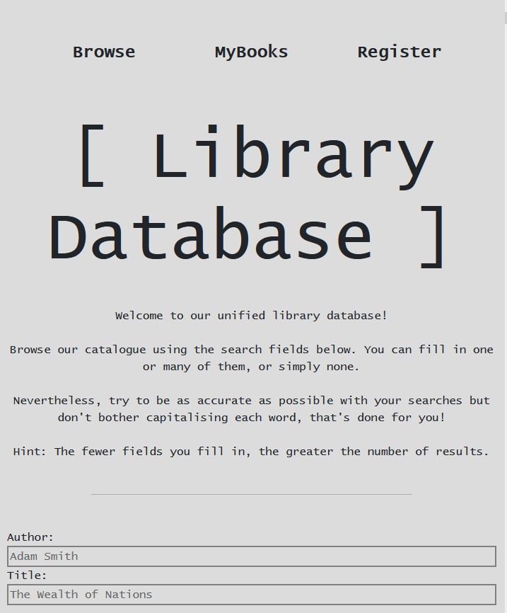
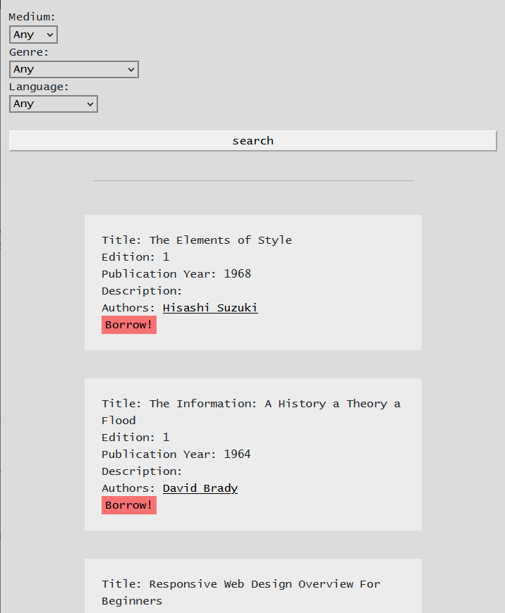

# Web Library
University project, May 2021: design and implementation of a library database accessible via the web

> Made use of the opportunity to hone my skills in [relational algebra](https://en.wikipedia.org/wiki/Relational_algebra), [database design](https://en.wikipedia.org/wiki/Database_design), [query optimisation](https://en.wikipedia.org/wiki/Query_optimization), and [responsive web design](https://en.wikipedia.org/wiki/Responsive_web_design).

## Tech Stack
* Modeling language: **entity-relationship model** (Chen notation)

* Server-side: **PHP 8.0.9 and Oracle SQL 19c**  

* Client-side: **HTML5, CSS3, Bootstrap 5**

## How to Deploy

1. set up a local database using [Oracle's RDBMS](https://www.oracle.com/database/technologies/appdev/sqldeveloper-landing.html) and modify your database credentials in [the databasehelper file](databasehelper.php) accordingly

2. run the [drop.sql](sources/drop.sql) and [create.sql](sources/create.sql) files in that order on your local server in order to instantiate all the necessary relations along with their integrity and reference constraints

3. either run the [dml.sql](sources/dml.sql) file to populate the database you've now created with some test data or run the [TestDataGenerator.jar](sources/TestDataGenerator.jar) (eg. in bash: `java -jar TestdataGenerator.jar`) for a larger set of tuples (thousands of rows)

4. open the [index.php](index.php) file in your browser

## Diagram

[entity-relationship diagram](ER-Diagram.pdf)

## Specifications

[Conceptual design](Specification.pdf)

## Screenshot of the Final Website

The website is designed with responsiveness in mind and thus maintains visual clarity regardless of the device it is viewed on.

### Desktop

### Tablet

## Smartphone

